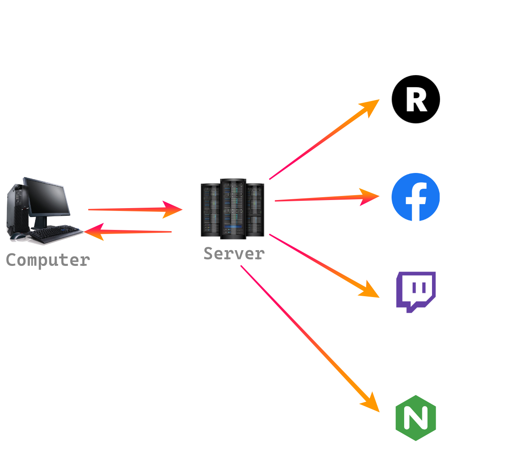
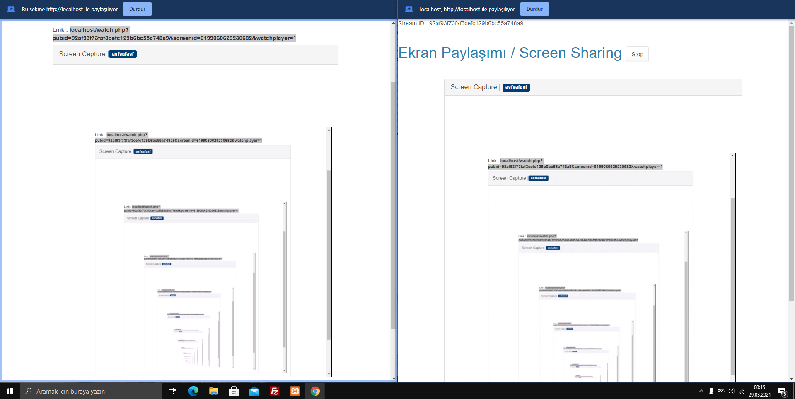

Merhabalar,

Bu program bir restream programıdır. Örneğin bilgisayarınızdan veya farklı bir kaynaktan yapılan yayını daha müsait bir sunucu üzerinden restream eden bir programdır.
Bu programla Twitch, Youtube ve benzeri yayınlar dahil her yayını restream edebilirsiniz. Ayrıca dediğim gibi kendiniz de RTMP server üzerinden yaptığınız yayınları restream edebilirsiniz.

Özellikleri
IP Ban (İstemediğiniz IP adreslerini banlayabilirsiniz)
IP Loglama (Yayınlarınıza kim hangi IP üzerinden bağlanmış görebilirsiniz)
Kullanıcı ekleme ve banlama (Server üzerinde kullanıcı oluşturabilir, onlara özel playlistler girebilir ve onları yasaklayabilirsiniz)
Yayın yapma (Panel üzerinden istediğiniz yayının adresine tıklayarak restream edebilirsiniz. Yayınlar M3U8 ve TS formatlarında yapılmaktadır)
Hazır bir M3U listesini yükleme (Hazır bir listeyi yükleyebilirsiniz)
Twitch ve YouTube yayınları stream etme (Sevdiğiniz Twitch yayıncılarını ve YouTube canlı yayınlarını stream edebilirsiniz)
Private IPTV özelliği (Bu özellikle yayınlarınızı sadece kendinize özel olarak panel üzerinden izleyebilirsiniz)
TV Özelliği (Yakında stabilize edilecek ve açıklamama gerek yok sanırım )
Reklam ekleme (Web üzerinden izlenen yayınlarınıza reklam ekleyebilirsiniz)
Web Player (Web üzerinden de yayınlarınızı izleyebilirsiniz)
Instagram, Facebook, Restream ve Twitter üzerinden restream etme (Yayınlarınızı bu platformlarda paylaşabilirsiniz)

Resimler
 

 

İndirme Linki : https://github.com/alicangnll/iptv-server

Kurulum (Windows için):
XAMPP PHP 7.4 için olan sürümünü indirin ve kurun
Ardından C:\xampp\htdocs üzerine bu linkten indirdiğiniz scripti kopyalayın
C:\xampp\htdocs\ffmpeg içerisindeki exe dosyalarını sisteminiz 64 bitse 64, 32 bitse 32 yazanı ffmpeg içerisine taşıyın
Browser üzerinden http://localhost/install.php ile kurun (default SQL user/pass : root/(boş))
Ardından panele default user pass (admin/19654) ile girebilirsiniz

Kurulum (Linux için)
CentOS son sürümü indirin ve mysql, php, php-pdo, httpd, epel-release, ffmpeg kurun
Ardından dosyaları /var/www/html içerisine yükleyin

Kullandığınız için teşekkür ederim. Ayrıca geri bildirimlerinizi mutlaka yazın. Onlara göre güncelleme çıkacağız.

NOT : İllegal yayınlar için sorumluluk kabul etmiyorum zira bu legal yayınlar için yapılmıştır. Teşekkürler.

 
